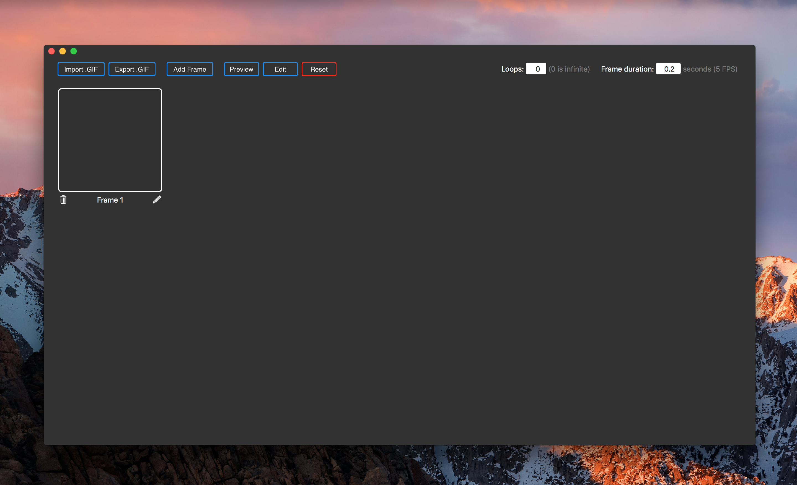
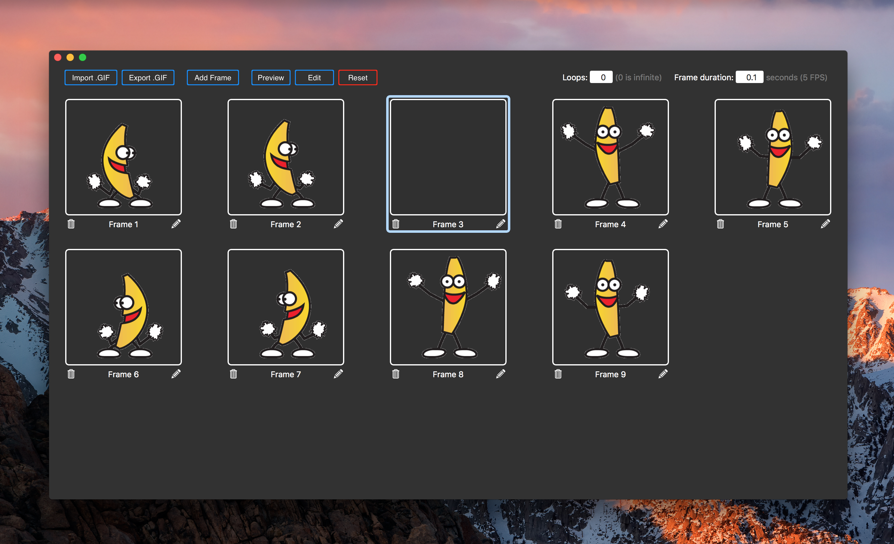
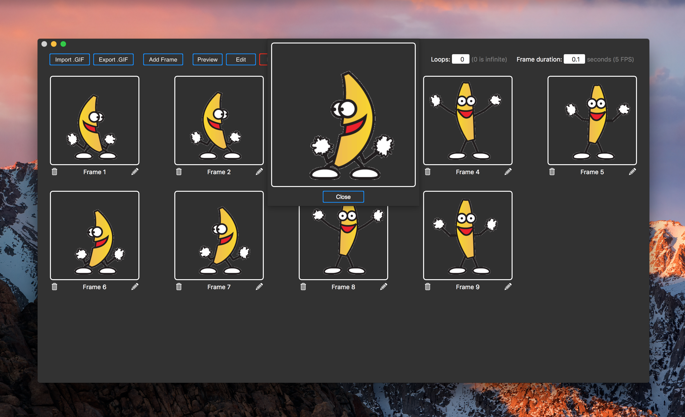

# GIF-Maker
Small application that allows the user to modify or create gifs. Drag and drop images to the empty frames, and drag and drop to change the order of frames.
Select a frame and 'Add frame' to add the frame next to the selected. Click the image view and a file panel will open, allowing the user to select an image to insert. Click the trashbin to remove the frame. Drag one or more images from outside the app to populate the view.

I'm working on the UI, and the editing feature. The editing feature is sort of broken, but I'll work it out eventually.

Screenshots:

