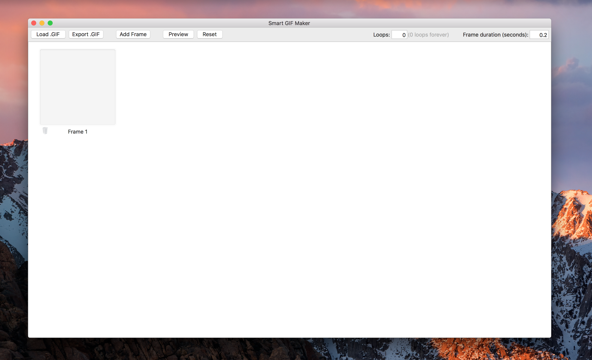

# GIF-Maker
Small application that allows the user to modify or create gifs. Drag and drop images to the empty frames, and drag and drop to change the order of frames.
Select a frame and 'Add frame' to add the frame next to the selected. Click the image view and a file panel will open, allowing the user to select an image to insert. Click the trashbin to remove the frame.

Screenshots:

